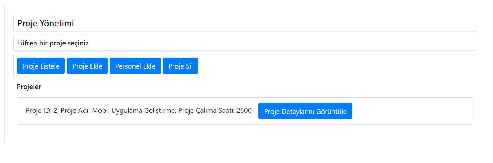

# Proje Yönetimi Uygulaması

Bu proje, JavaScript, HTML ve Bootstrap kullanılarak geliştirilmiş bir proje yönetim uygulamasıdır. API üzerinden mevcut projeleri ve projede çalışanların detaylarını görüntüleyebilir, yeni projeler ekleyebilir ve var olan projeleri API'dan çıkarabilirsiniz.

## Önizleme



## Nasıl Çalıştırılır
 ```bash
1. Depoyu klonlayın:
  
   git clone https://github.com/seher-akbas/Proje-Yonetimi.git
2. Proje klasörüne gidin
   cd Proje-Yonetimi
   
3. index.html dosyasını bir web tarayıcısında açın.
   
## Kullanım
1. Proje Listele butonu ile mevcut projeleri görüntüleyin, detaylarını inceleyin.
2. Yeni bir proje eklemek için Proje Ekle butonuna tıklayın ve gerekli bilgileri girin.
3. Varolan bir projeyi silmek için Proje Sil butonuna tıklayın.
4. Projelere personel eklemek için Personel Ekle butonuna tıklayın

## Dosya Yapısı
index.html: Ana HTML dosyası. (stillendirme için Bootstrap kullanılmıştır)
script.js: JavaScript dosyası (uygulamanın iş mantığı burada).

## Kullanılan Teknolojiler
HTML
CSS (Bootstrap)
JavaScript
